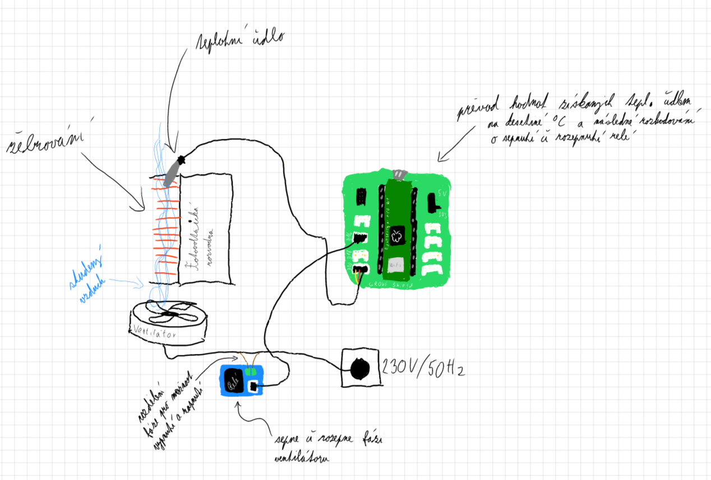
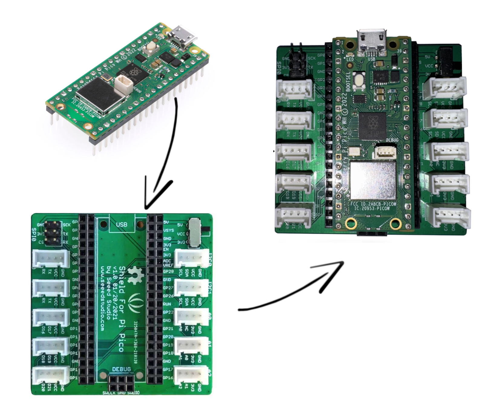
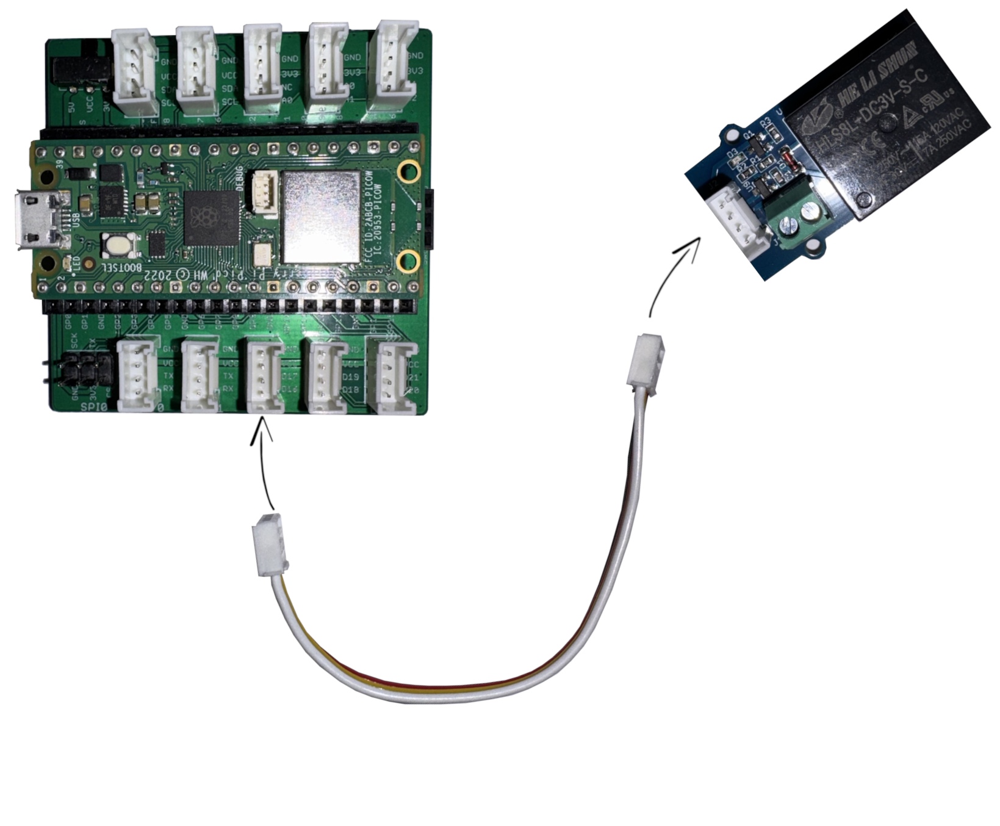
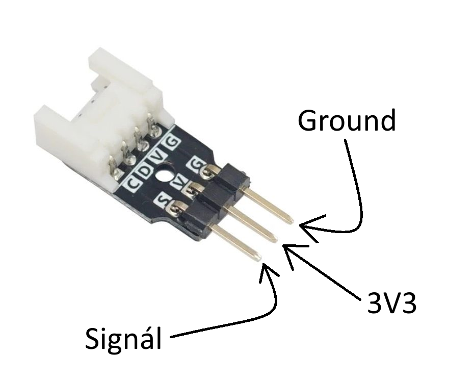
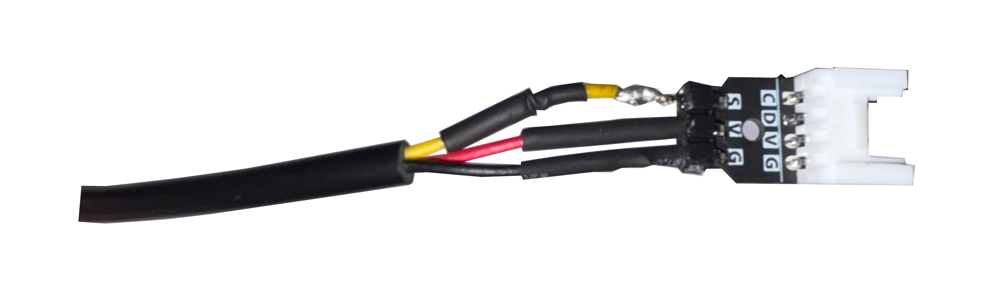
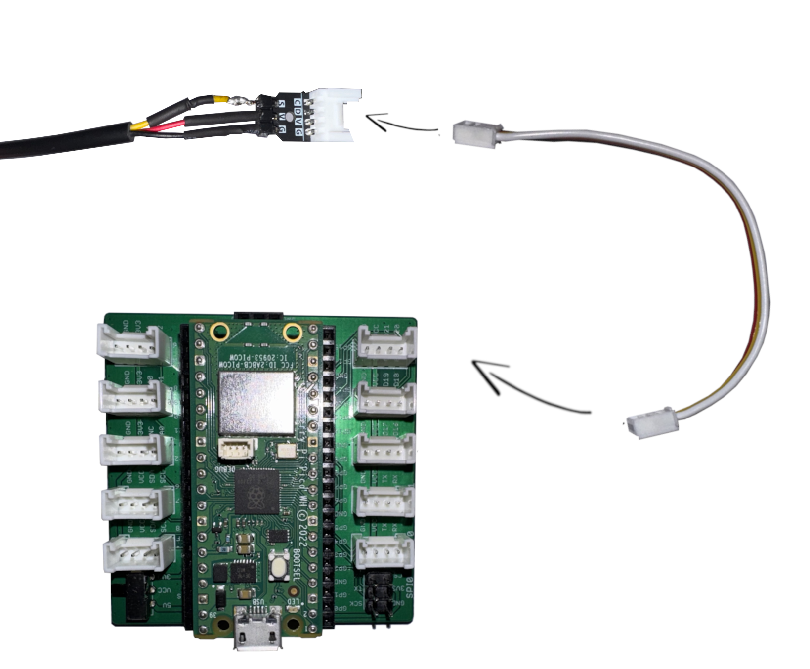
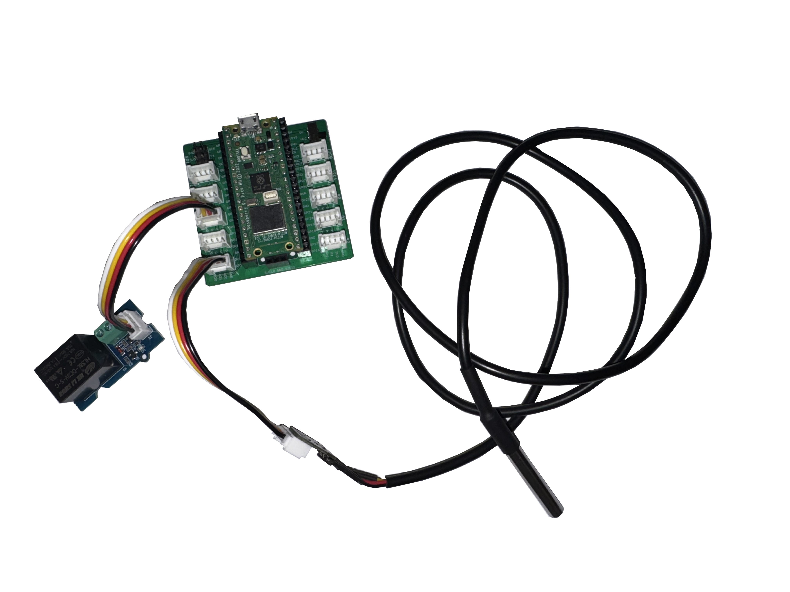
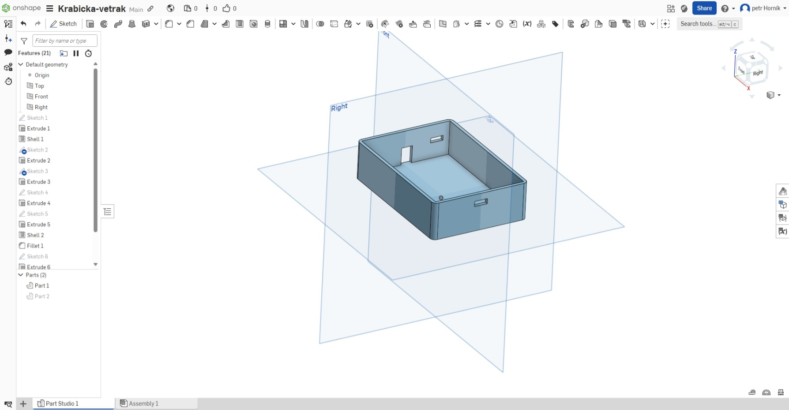
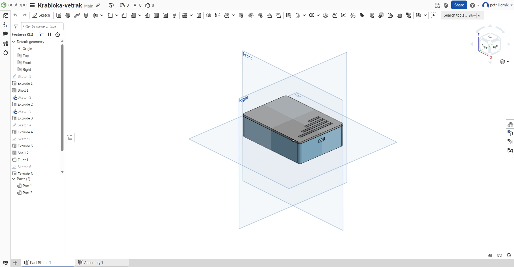

# VENTILÁTOR SPÍNANÝ TEPLOTOU

## CÍL:

Cílem tohoto projektu je vytvořit automatický chladící systém pro fotovoltaickou elektrárnu, z důvodu jejího neustálého přehřívání při vysokém využijí v letních sezónách. Projekt jsem se rozhodl vytvořit, jelikož mi přišlo zbytečné nechávat neustále puštěný ventilátor, který zbytečně spotřebovává energii i během noci když není chlazení potřeba. 

## Použité komponenty

- [Raspberry Pi pico 2 WH](https://rpishop.cz/raspberry-pi-pico/5074-raspberry-pi-pico-wh.html)
- [Grove Shield pro RPi Pico v1.0](https://rpishop.cz/rozsirujici-karty/3613-grove-shield-pro-pi-pico-v10.html)
- [Grove - Relé](https://rpishop.cz/moduly/2220-grove-rele.html)
- [Vodotěsný teplotní senzor DS18B20](https://rpishop.cz/550139/odseven-vodotesny-teplotni-senzor-ds18b20-5m/)
- [1x Adaptér Grove na pin](https://rpishop.cz/propojky/3060-adapter-grove-na-pin-5ks.html)
- [2x Grove 4pinový propojovací kabel žena-žena - 10 cm](https://botland.cz/grove-propojovaci-kabely/18094-grove-sada-5-4kolikovych-kabelu-zena-zena-10-cm-6972934171399.html)

Veškeré komponenty byly zakoupeny na internetových e-shopech [RPIshop.cz](https://rpishop.cz/) a [Botland.cz](https://botland.cz/) - ověřené a spolehlivé

V projektu se k propojení jednotlivých komponent používá ekosystém GROVE od spol. seeed studio, díky kterému se do projektu dají zakomponovat další součásky bez potřeby jakéhokoli pájení(Pokud se nejedná o oficiální GROVE komponent tak se musí dopájet koncovka).

Pokud nechcete používat ekosystém GROVE, tak tento projekt lze zrealizovat i pomocí nepajivého pole či přímého spojení drátů.

## Tvoření projektu

   Se samotným nápadem přišel můj otec, když jsem se ho ptal co bych mohl udělat za projekt, jelikož jsem nevěděl co udělat. Tento projekt se mi zalíbil, protože zároveň pro něj bude během léta i praktické využití. Jelikož se jedná o můj první samostatný projekt tohoto typu tak sem se rozhodl, že chci využít nějakou možnost ,kde nebudu potřebovat pájení(nebo úplně minimálně) a nebudu k realizaci potřebovat nepájivé pole(zabírá moc místa). Proto jsem objevil [ekosystém GROVE](https://wiki.seeedstudio.com/Grove_System/) který umožňuje snadné propojení komponent pomocí jejich speciálních 4pinových konektorů. Po vybrání všech potřebných komponent(viz. "Použité Komponenty") jsem je objednal na e-shopech [RPIshop.cz](https://rpishop.cz/) a [Botland.cz](https://botland.cz/). Zprovoznění relé nebyl žádný problém, protože se jednalo o GROVE verzi a tak stačilo pouze propojit relé digitální port(D16) na GROVE Shield. Digitální porty na Grove Shield fungují stejně jako piny na Raspberry a díky oficiální [GROVE dokumentaci](https://wiki.seeedstudio.com/Grove_System/) od Seeed Studio nebylo napsání programové části pro relé žádný problém. S teplotním čidlem to bylo horší, jelikož nepodporovalo GROVE ekosystém, proto zde jsem musel [připájet](https://github.com/petrhornik/Ventilator_spinany_teplotou#3-nap%C3%A1j%C3%ADme-adapt%C3%A9r-grove-na-pin-na-ds18b20) adaptér pro který neexistuje žádná dokumentace. První pokus nedopadl dobře jelikož se mi povedlo "uškvařit plast na pinech adaptéru". Druhý pokus dopadl podobně, z někého důvodu mi čidlo nevracelo číselné hodnoty teploty i přes to, že se nevypsala žádná chyba(program detekuje teploměr). Díky odborné pomoci se ale třetí pokus vydařil a já mohl pokračovat ve tvorbě kódu. Výsledný kód vznikl pomocí online materiálu a následné úpravy a zakomponování funkce pro relé.

Odkaz na program -> [PROGRAM](https://github.com/petrhornik/Ventilator_spinany_teplotou/blob/main/main.py)

## Popis funkce

   Teploměr bude umístěn na či do žebrování fotovoltaické rozvodny, čož je hlavní zdroj vzniku tepla. Pokud naměřená teplota překročí 35 stupňů Celsia tak se sepne relé. Na relé je přivedena fáze ventilátoru, který je zespoda namířen na fotovoltaickou rozvodnu tak, aby horký vzduch unikal vrchem. Díky tomuto nedojde k foukání studeného vzduchu na teploměr. [V budoucnu přibydou další funkce!]

   

## Postup Zapojení
### 1) Zapojíme Raspberry Pi Pico 2 WH do Grove Shield pro RPi Pico v1.0
   

   Pokud se později rozhodnete Raspberry z Grove Shield vyndat, musíte takto učinit s vysokou opatrností - hrozí zohnutí pinů. 

### 2) Propojíme relé s Grove Shield pro RPi Pico v1.0(D16)

   

   Zde si při zapojování dávejte pozor - propojovací kabely jsou křehké a jednotlivé kabely nejsou mezi koncovkami nijak chráněny, proto při příliž hrubém zacházení, namáhání či samotném zapojování hrozí přetrhnutí kabelů.

### 3) Napájíme adaptér Grove na pin na DS18B20

   
   

   

   Při pájení musíme také dbát zvýšené pozornosti, jelikož adaptér má atypické rozložení pinů na staně pájení(napájecí 3v3 a signálový jsou prohozené). Zároveň plast pokrývající konce "pájecích" pinů je velmi náchilný na vysoké teploty a při pájení se plast může "uškvařit" a poté je konektor nepoužitelný.

### 4) Propojíme teploměr s Grove Shield pro RPi Pico v1.0(D20)

   

### 5) Finální podoba

   Po zapojení všech komponent dle návodu by váš výsledek měl vypadat nějak takto :D.

   

   1) Grove Shield pro RPi Pico v1.0
   2) Raspberry Pi Pico 2 WH
   3) Grove - Relé
   4) Teplotní čidlo DS18B20
   5) Adaptér Grove na pin

## 3D krabicka pro komponenty
   Vlastní model krabičky pro komponenty modelovaný v OnShape.

  
  

   ### Odkazy
   [KRABIČKA](https://github.com/petrhornik/Ventilator_spinany_teplotou/blob/main/3D_model_krabicka/Krabicka%20-%20vetrak.stl)
   
   [VÍČKO](https://github.com/petrhornik/Ventilator_spinany_teplotou/blob/main/3D_model_krabicka/Vicko%20-%20vetrak.stl)

## Video
   Video s ukázkou zapojení, názornou ukázkou, vysvětlením kódu.
   
   https://youtu.be/8o-7jNo1G1U

   Poznámka: Počítač je ve videu připojen pouze z důvodu zobrazování teploty pro video, pro finální funkci stačí připojit RPI Pico pouze k napíjení.
## Věci do budoucna

   Chci později přidat další funkce, např.: měnění rozhodovací teploty pomocí webového rozhraní, připojení dalších čidel, propojení s jinými projekty skrze Raspberry PI 5(DIY chytrá domáctnost).

## Citace a literatura

SEEED TECHNOLOGY CO.,LTD. Grove Systém - Návody/Dokumentace. Online. Dostupné z: https://wiki.seeedstudio.com/Grove_System/. [cit. 2024-12-19].

SEEED TECHNOLOGY CO.,LTD. One Wire Temperature Sensor DS18B20. Online. Dostupné z: https://wiki.seeedstudio.com/One-Wire-Temperature-Sensor-DS18B20/. [cit. 2024-12-19].

RANDOMNERDTUTORIALS.COM. Raspberry Pi Pico: DS18B20 Temperature Sensor (MicroPython) – Single and Multiple. Online. Dostupné z: https://randomnerdtutorials.com/raspberry-pi-pico-ds18b20-micropython/. [cit. 2024-12-19].
