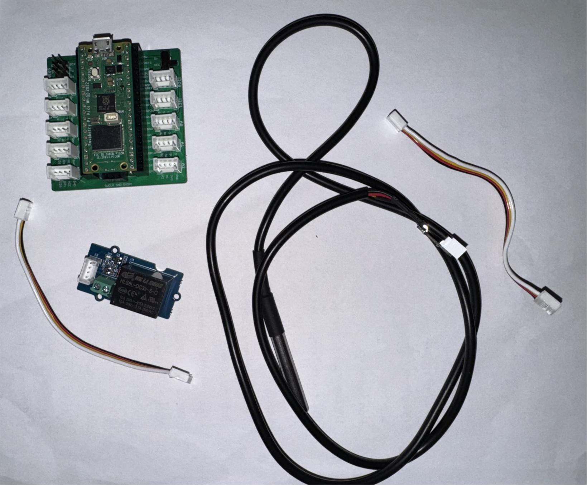

# VENTILÁTOR SPÍNANÝ TEPLOTOU

## CÍL:

Cílem tohoto projektu bylo vytvořit automatický chladící systém pro fotovoltaickou elektrárnu,
z důvodu jejího neustálého přehřívání při letních sezónách.

## Použité komponenty

- Raspberry Pi pico 2 WH
- Grove Shield pro RPi Pico v1.0
- Grove - Relé
- Vodotěsný teplotní senzor DS18B20
- 1x Adaptér Grove na pin
- 2x Grove 4pinový propojovací kabel žena-žena - 10 cm

## Postup Zapojení

## Schéma zapojení

## Věci do budoucna

## Citace

https://randomnerdtutorials.com/raspberry-pi-pico-ds18b20-micropython/
https://wiki.seeedstudio.com/Grove_System/
https://wiki.seeedstudio.com/One-Wire-Temperature-Sensor-DS18B20/
